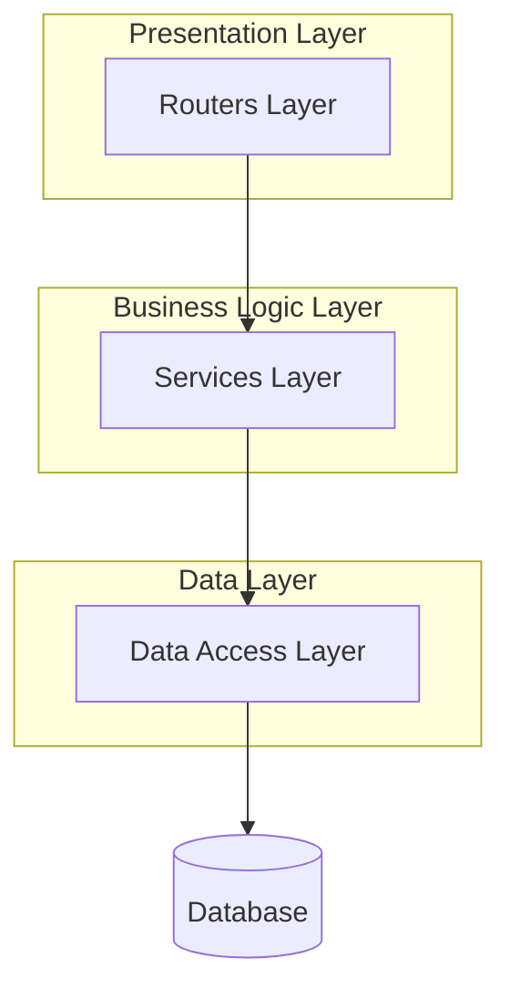
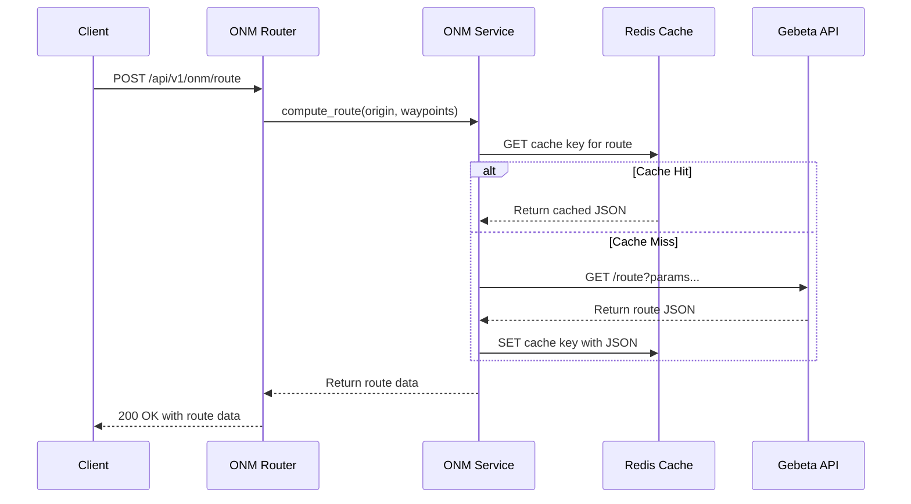
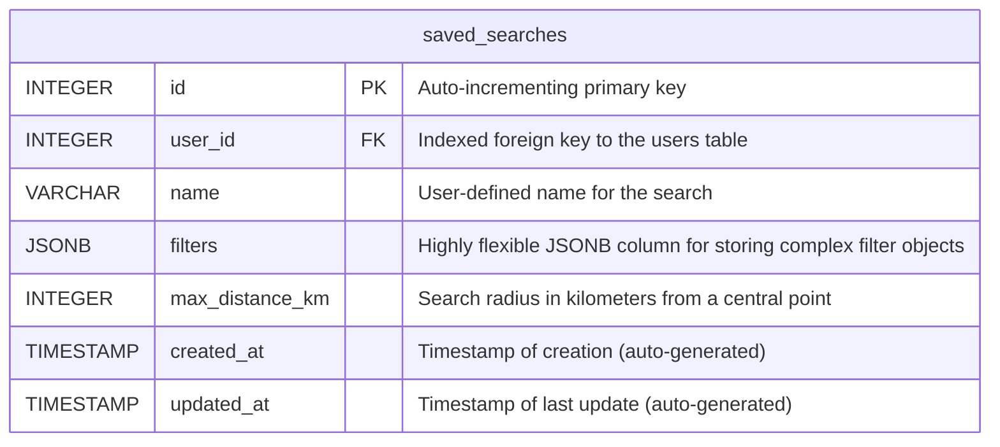

# Property Search & Filter Service

[](https://www.python.org/downloads/)
[](https://fastapi.tiangolo.com/)
[](https://www.postgresql.org/)
[](https://opensource.org/licenses/MIT)

A robust and scalable microservice built with FastAPI to handle property searches, apply complex filters, and manage user-saved searches for a modern rent management system.

---

## Table of Contents

- [About The Project](#about-the-project)
- [Architectural Design Patterns](#architectural-design-patterns)
  - [Microservice Architecture](#microservice-architecture)
  - [Internal Layered Architecture](#internal-layered-architecture)
- [Technology Stack](#technology-stack)
- [External Service Integrations](#external-service-integrations)
  - [Gebeta Map Service Integration](#gebeta-map-service-integration)
- [Key Features](#key-features)
- [Database Schema](#database-schema)
- [Getting Started](#getting-started)
  - [Prerequisites](#prerequisites)
  - [Local Installation](#local-installation)
  - [Running with Docker](#running-with-docker)
- [API Endpoint Documentation](#api-endpoint-documentation)
- [Running Tests](#running-tests)
- [Contributing](#contributing)
- [License](#license)
- [Contact](#contact)

---

## About The Project

This service is a core component of the **Rent Management System** ecosystem. Its primary responsibility is to provide a centralized, high-performance API for finding properties and managing user preferences. By decoupling search functionality into a dedicated microservice, we can independently scale, update, and maintain search-related logic without impacting other parts of the system.

It is designed to be fast, efficient, and easily integrable, providing the backend power for users to sift through thousands of property listings with complex criteria and to save those criteria for instant access later.

---

## Architectural Design Patterns

This service is designed using a combination of high-level and internal architectural patterns to ensure separation of concerns, scalability, and maintainability.

### Microservice Architecture

At a high level, this application is a **Microservice**. It is a small, autonomous service that works with other services to form a larger application. This approach provides several advantages:
- **Decoupling**: Search and filter functionality is completely isolated, so it can be developed, deployed, and scaled independently of other services like user management or payments.
- **Resilience**: A failure in this service will not necessarily bring down the entire rent management platform.
- **Technology Flexibility**: While this service uses FastAPI and Python, other microservices in the ecosystem could be built with different technology stacks best suited for their specific tasks.

### Internal Layered Architecture

Internally, the service follows a classic **Layered (or N-Tier) Architecture** to separate responsibilities within the application itself.



-   **Presentation Layer (`app/routers`)**: This is the outermost layer. Its responsibility is to handle HTTP requests and responses. It defines the API endpoints, validates incoming data using Pydantic schemas, and handles HTTP-specific concerns like status codes and headers. It delegates the actual work to the Services Layer.
-   **Business Logic Layer (`app/services`)**: This is the core of the application. It contains the business rules and orchestrates application processes. For example, the `onm_service` coordinates fetching data from the database and making calls to the external Gebeta API. It is completely independent of the web and database layers.
-   **Data Access Layer (`app/models`, SQLAlchemy)**: This layer is responsible for all communication with the database. It defines the database schema (models) and handles all CRUD (Create, Read, Update, Delete) operations. By isolating data access, we can easily change the database or ORM without affecting the business logic.

---

## Technology Stack

- **Backend Framework:** [FastAPI](https://fastapi.tiangolo.com/)
- **Database:** [PostgreSQL](https://www.postgresql.org/)
- **Caching:** [Redis](https://redis.io/)
- **ORM & Migrations:** [SQLAlchemy](https://www.sqlalchemy.org/) & [Alembic](https://alembic.sqlalchemy.org/)
- **Data Validation:** [Pydantic](https://pydantic-docs.helpmanual.io/)
- **Authentication:** JWT Bearer Tokens
- **Containerization:** [Docker](https://www.docker.com/)
- **Testing:** [Pytest](https://docs.pytest.org/)

---

## External Service Integrations

### Gebeta Map Service Integration

This service relies heavily on the **Gebeta Map Service** for geospatial calculations and routing. The integration is encapsulated within the `app/services/gebeta.py` and `app/services/onm.py` modules.

**Purpose:**
The Gebeta service provides critical location-based intelligence, including:
-   Calculating driving routes and distances between multiple points.
-   Providing a distance matrix to find the nearest points of interest.
-   Geocoding queries into latitude/longitude coordinates.

**Integration Flow:**
1.  **API Endpoints**: The integration is primarily used by the `/api/v1/onm/route` and `/api/v1/onm/nearest` endpoints.
2.  **Service Layer**: The `onm_service` prepares the data (e.g., lists of coordinates) and calls the appropriate function in the `gebeta_service`.
3.  **HTTP Client**: The `gebeta_service` uses `httpx` to make asynchronous HTTP GET requests to the Gebeta API endpoints (e.g., `https://api.gebeta.app/route`, `https://api.gebeta.app/matrix`). The required `GEBETA_API_KEY` is sent in the headers.
4.  **Caching**: To improve performance and reduce costs, all calls to the Gebeta API are cached in **Redis**. A cache key is generated based on the request parameters (e.g., `onm:origin:[waypoints]`). If a result is found in the cache, it is returned immediately, bypassing the HTTP request. Cached results have a timeout (e.g., 10 minutes) to ensure data freshness.
5.  **Retry Logic**: All external calls are wrapped in a `@retry` decorator, which automatically retries the request up to 3 times with an exponential backoff delay if it fails. This makes the integration more resilient to transient network issues.



---

## Key Features

- **Advanced Property Search**: Implements complex, multi-faceted search logic to query property data.
- **Personalized Saved Searches**: Authenticated users can create, name, view, and delete their personalized search queries.
- **Secure JWT Authentication**: All sensitive endpoints are secured using JSON Web Tokens.
- **Fully Asynchronous**: Built on the ASGI standard for high-concurrency and non-blocking I/O.
- **Robust Database Migrations**: Utilizes Alembic to manage database schema evolution in a safe, version-controlled manner.
- **Resilient External API Calls**: Features retry-on-failure and Redis caching for all external API interactions.
- **Containerized & Portable**: Fully containerized with Docker for consistent environments.

---

## Database Schema

The primary table, `saved_searches`, is central to this service.


The use of `JSONB` for the `filters` column is a key design choice, allowing the frontend to store arbitrary, nested filter structures without requiring database schema changes.

---

## Getting Started

### Prerequisites

- Python 3.9+ & `pip`
- Docker & Docker Compose
- A running PostgreSQL instance
- A running Redis instance

### Local Installation

1.  **Clone the repository:**
    ```sh
    git clone https://github.com/rent-management-system/search-and-filter-service.git
    cd search-and-filter-service
    ```

2.  **Set up the environment file:**
    ```sh
    cp .env.example .env
    ```
    Open `.env` and fill in your `DATABASE_URL`, `REDIS_URL`, and `GEBETA_API_KEY`.

3.  **Create a virtual environment and install dependencies:**
    ```sh
    python -m venv .venv
    source .venv/bin/activate
    pip install -r requirements.txt
    ```

4.  **Run database migrations:**
    ```sh
    alembic upgrade head
    ```

5.  **Run the application:**
    ```sh
    uvicorn app.main:app --reload --host 0.0.0.0 --port 8000
    ```
    The API documentation will be available at `http://localhost:8000/docs`.

### Running with Docker

1.  **Build the Docker image:**
    ```sh
    docker build -t search-filter-service .
    ```

2.  **Run the container:**
    ```sh
    docker run -p 8000:8000 --env-file .env search-filter-service
    ```

---

## API Endpoint Documentation

All endpoints require a valid JWT `Bearer` token in the `Authorization` header.

### `POST /search/`
Creates a new saved search for the authenticated user.

- **Authentication:** Required
- **Request Body:**
  ```json
  {
    "name": "My Downtown Apartment Search",
    "filters": { "property_type": "Apartment", "max_price": 2500 },
    "max_distance_km": 5
  }
  ```
- **Success Response (`201 Created`):**
  ```json
  {
    "id": 1,
    "name": "My Downtown Apartment Search",
    "user_id": 123,
    "filters": { "property_type": "Apartment", "max_price": 2500 },
    "max_distance_km": 5,
    "created_at": "2025-11-18T10:00:00Z",
    "updated_at": "2025-11-18T10:00:00Z"
  }
  ```

### `GET /search/`
Retrieves a list of all saved searches for the authenticated user.

- **Authentication:** Required
- **Success Response (`200 OK`):**
  ```json
  [
    { "id": 1, "name": "My Downtown Apartment Search", "user_id": 123, "max_distance_km": 5 }
  ]
  ```

---

## Running Tests

```sh
pytest
```

---

## Contributing

Contributions are greatly appreciated. Please fork the repository and open a pull request.

---

## License

Distributed under the MIT License.

---

## Contact

**Dagmawi Teferi**

- **Email:** [dagiteferi2011@gmail.com](mailto:dagiteferi2011@gmail.com)
- **WhatsApp:** `+251920362324`
- **Project Link:** [https://github.com/rent-management-system/search-and-filter-service](https://github.com/rent-management-system/search-and-filter-service)